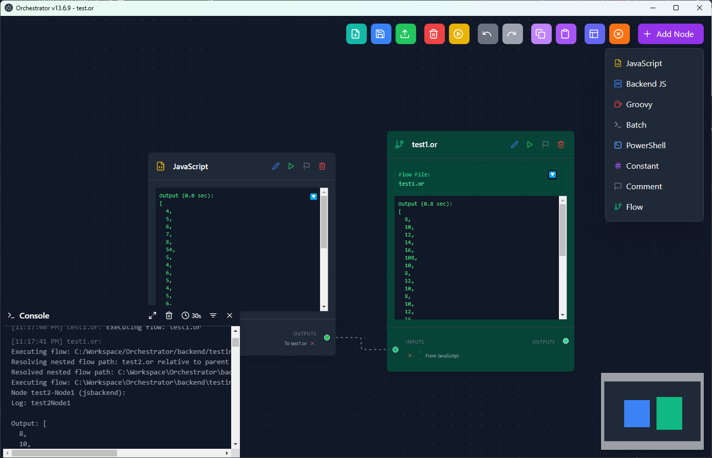

# 🎭 Orchestrator

Orchestrator is a cross-platform desktop application built with Electron, React, and Node.js. It enables you to visually orchestrate, edit, and execute custom scripts or nodes (JavaScript, Batch, Groovy, PowerShell, Playwright) through a modern, interactive graphical interface.



## 🚀 Features

- 🖥️ Intuitive drag-and-drop GUI for building and managing node-based flows
- ⚡ Execute scripts in JavaScript (frontend & backend), Groovy, Batch, PowerShell, and Playwright
- 📝 Visualize, edit, and connect nodes with custom code or constants
- 🔄 Save, load, and version flows as `.or` or `.json` files
- 🧩 Add comments and documentation nodes to your flows
- 🖊️ Built-in code editor with syntax highlighting for multiple languages
- 🪝 Advanced console for real-time logs, outputs, and error tracking per node
- 🗂️ File-based backend orchestration with inbox/outbox job processing
- 🖱️ Keyboard shortcuts for quick save/load (Ctrl/Cmd+S, Ctrl/Cmd+O)
- 🖼️ Resizable, customizable nodes and flow layout auto-arrangement
- 🛠️ Full Electron integration for native desktop experience

## 📦 Getting Started

### Prerequisites

- [Node.js](https://nodejs.org/) (v18 or higher recommended)
- [npm](https://www.npmjs.com/) (usually included with Node.js)

### Installation

```bash
# Clone the repository
git clone https://github.com/antoine-marchal/Orchestrator.git
cd Orchestrator

# Install dependencies
npm install
```

### Development Usage

```bash
# Start the backend (Node.js)
npm run backend

# Start the frontend (React)
npm run dev

# Launch the Electron app
npm run electron

# Or use all-in-one (backend + frontend)
npm run start
```

> **Tip:** In development mode, the interface opens at `http://localhost:5173`.

### Production Usage

```bash
# Build the frontend
npm run build

# Launch the packaged application
npm run dist
```

## 📂 Project Structure

| Directory/File | Description |
|----------------|-------------|
| `electron-main.js` | Main Electron entry point, manages the window and backend |
| `src/` | React source code (frontend) |
| `src/components/` | UI components (FlowEditor, CodeEditorModal, Console, etc.) |
| `src/store/` | State management for flows and nodes |
| `src/types/` | TypeScript types for nodes and edges |
| `backend/` | Node.js backend for script execution and orchestration |
| `preload/` | Electron preload scripts for secure IPC |
| `build/` | App icons and build resources |

## 🧩 Node Types

Orchestrator supports various node types, each with a unique icon for quick identification:

| Node Type | Icon | Description |
|-----------|------|-------------|
| **JavaScript** | FileCode (yellow) | Run code in the frontend context |
| **Backend JS** | Server (blue) | Run JavaScript in the backend context |
| **Groovy** | Coffee (red) | Execute Groovy scripts via the backend |
| **Batch** | Terminal (gray) | Run Windows batch scripts |
| **PowerShell** | TerminalSquare (blue) | Execute PowerShell scripts |
| **Playwright** | Browser | Automate browser tasks using Playwright |
| **Constant** | Hash (purple) | Provide static values as node input |
| **Comment** | MessageSquare (gray) | Add documentation/comments to your flow |
| **Flow** | GitBranch (green) | Reference another flow file (see Flow Nodes section) |

## 🔧 Core Features

### 🖊️ Code Editing

- Edit node code with syntax highlighting (Ace Editor)
- Supports JavaScript, Groovy, Batch, PowerShell
- Keyboard shortcuts: Save (Ctrl/Cmd+S), Close (Esc)

### 🪝 Console & Logging

- Real-time per-node logs, input/output, and error tracking
- Filter log types (input, output, log, error)
- Expand/collapse and fullscreen console view

### 🗂️ Backend Orchestration

- File-based inbox/outbox job processing for secure script execution
- Supports running scripts in isolated processes
- Groovy, Batch, PowerShell, Playwright, and Node.js backend execution

### 🖱️ Keyboard Shortcuts

- **Ctrl/Cmd+S**: Save flow
- **Ctrl/Cmd+O**: Open flow
- **Esc**: Close modals/editor

## 🌊 Flow Nodes

Flow nodes are a powerful feature that allows you to create reusable, modular workflows by referencing external flow files.

### What are Flow Nodes?

Flow nodes act as containers that execute another flow file, enabling hierarchical workflow composition and code reuse. They serve as building blocks for complex workflows, allowing you to:

- Break down complex processes into manageable, reusable components
- Create modular workflows that can be nested within other workflows
- Organize related functionality into separate flow files
- Reuse common workflow patterns across multiple projects

### Creating and Editing Flow Nodes

1. **Creating a Flow Node**:
   - Click the **Add Node** button or right-click in the editor canvas
   - Select **Flow** from the dropdown menu
   - Choose an existing flow file (`.or` file)

2. **Editing a Flow Node**:
   - Double-click on the flow node in the editor
   - Choose a different flow file to be referenced

When you create or edit a flow node, the referenced flow file automatically opens in a new Orchestrator window.

### How Flow Nodes Execute

Flow nodes operate by executing the entire workflow contained in the referenced flow file:

1. **Input Processing**: The flow node receives input data from connected input nodes
2. **Flow File Loading**: The system loads the referenced flow file
3. **Dependency Resolution**: The system determines the execution order
4. **Sequential Execution**: Each node in the referenced flow is executed
5. **Result Collection**: The output from the last node becomes the output of the flow node
6. **Output Passing**: This output is passed to connected nodes

### Best Practices

- **Single Responsibility**: Design each flow file to perform a specific task
- **Meaningful Names**: Use descriptive filenames for your flow files
- **Hierarchical Structure**: Create a logical hierarchy of flows
- **Consistent Inputs/Outputs**: Maintain consistent formats for compatibility
- **Complexity Management**: Break complex workflows into smaller flow files
- **Documentation**: Add comment nodes to document purpose and expected inputs/outputs

### Example Use Cases

- **Data Processing Pipelines**: Data cleaning, format conversion, enrichment
- **Business Process Automation**: Customer onboarding, order processing, approvals
- **Integration Scenarios**: API handling, authentication flows, error handling

## 🖥️ Command Line Execution

Orchestrator supports executing flows directly from the command line without opening the UI:

```bash
orchestrator.exe -s path/to/flow.or
# or
orchestrator.exe --silent path/to/flow.or
```

In silent mode, Orchestrator:
1. Starts the backend services
2. Executes the specified flow file
3. Outputs results to the console
4. Exits automatically when execution is complete

## 📦 Packaging & Distribution

To generate an executable for Windows, Mac, or Linux:

```bash
npm run dist
```

## 🤝 Contributing

Contributions are welcome!
- Fork the project
- Create a branch
- Open a Pull Request

## 🔗 Useful Links

- [Electron](https://www.electronjs.org/)
- [React](https://react.dev/)
- [Node.js](https://nodejs.org/)
- [Playwright](https://playwright.dev/)
- [Ace Editor](https://ace.c9.io/)

---
© 2024 Orchestrator. All rights reserved.